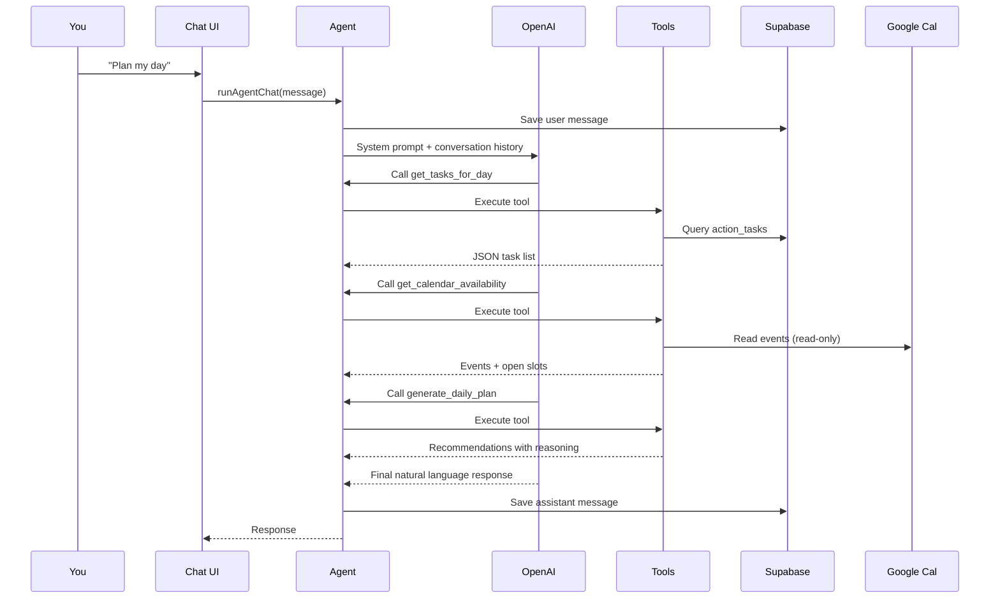

# Primetime AI Agent

The Primetime agent is a personal **execution accountability coach** built into the `/chat` tab. It helps you understand the gap between what you committed to do and what you actually did.

This is not a general-purpose chatbot. It is a reasoning layer on top of your structured execution data in Supabase.

---

## Core design principle

```
Database = source of truth
Agent    = reads state, reasons, writes via tools
LLM      = never owns state
```

The agent does not store goals, tasks, or progress in conversation memory. Every response should be grounded in live database reads through tools. Calculations (execution rate, pace status, calendar slots) are done by deterministic backend code — not by the LLM.

---

## What it does (for our use case)

| Role | What it means in practice |
|------|-------------------------|
| **Planner** | Suggests when to work on tasks based on Google Calendar availability and goal pace |
| **Accountability coach** | Calls out missed commitments, behind-pace goals, and low execution rates |
| **Progress logger** | Marks tasks complete, partially complete, missed, or skipped when you tell it |
| **Goal setter** | Creates weekly goals and linked daily action tasks |
| **Reflector** | Summarizes your day or week with planned vs actual analysis |
| **Pattern spotter** | Surfaces long-term habits from `behavior_insights` |

### Primary insight it optimizes for

**What you said you were going to do vs what you actually did.**

---

## How a chat turn works



1. Your message is saved to `agent_messages`.
2. The agent receives the system prompt plus prior user/assistant messages in the thread.
3. OpenAI decides which tools to call (if any).
4. Each tool runs server-side against Supabase or Google Calendar.
5. The agent composes a response using tool results.
6. The response is saved and shown in the UI.

**Code entry points:**

- Chat UI: `src/components/chat/chat-interface.tsx`
- Agent runner: `src/agent/index.ts`
- Tools: `src/agent/tools/index.ts`
- System prompt: `src/agent/prompts.ts`

---

## Permissions: what it can and cannot do

### Can do (via 13 tools)

#### Read — Supabase

| Tool | Access |
|------|--------|
| `get_active_goals` | Weekly goals for the current (or specified) week |
| `get_goal_progress` | Completion %, pace status (ahead/on track/behind), daily targets |
| `get_tasks_for_day` | Action tasks for a specific date |
| `get_tasks_for_week` | Action tasks for a week range |
| `get_behavior_insights` | Stored execution habit patterns |

#### Read — Google Calendar (read-only)

| Tool | Access |
|------|--------|
| `get_calendar_availability` | Your calendar events + computed open time slots for a day |

The agent **cannot** create, edit, or delete calendar events.

#### Write — Supabase

| Tool | Access |
|------|--------|
| `create_weekly_goal` | Insert a row in `weekly_goals` |
| `create_task` | Insert a row in `action_tasks` (records a `created` event in `task_events`) |
| `update_task_status` | Change task status; writes audit trail to `task_events` |
| `log_task_progress` | Log partial/full completion; may update linked goal `current_value` |

#### Compute — server logic (no direct DB schema changes)

| Tool | Access |
|------|--------|
| `generate_daily_plan` | Match unscheduled tasks to calendar slots with reasoning |
| `generate_daily_summary` | Build end-of-day planned vs completed metrics |
| `generate_weekly_summary` | Build end-of-week goal and priority analysis |

### Cannot do

| Action | Why |
|--------|-----|
| Access **Current Tasks** (mind dump / Eisenhower matrix) | Separate table (`current_tasks`); no agent tools exist yet |
| Delete goals or tasks | No delete tools |
| Edit goal titles, targets, or dates after creation | No update-goal tool |
| Write to Google Calendar | Read-only integration |
| Send email, browse the web, or call external APIs | Not in tool set |
| Run calculations itself | Metrics come from `src/services/metrics.ts` via tools |
| Authenticate as multiple users | Single-user app; no auth layer |

---

## Tool reference

### `get_active_goals`
Returns weekly goals (active, met, partially met) for the current week, or a specific week if `week_start` is passed.

### `get_goal_progress`
Returns per-goal: completion %, pace status, days remaining, expected value, daily target.

### `get_tasks_for_day` / `get_tasks_for_week`
Returns action tasks with status, priority, scheduling, and optional `weekly_goal_id` link.

### `get_calendar_availability`
Returns `{ events, available_slots, error }` for a day. Uses `CALENDAR_TIMEZONE` (default `America/Los_Angeles`).

### `create_weekly_goal`
Creates a weekly commitment. Required fields: `title`, `priority` (P0/P1/P2), `target_type` (count/hours/sessions/boolean), `target_value`.

**Important:** Always call this before creating tasks for a new weekly commitment.

### `create_task`
Creates a daily action task. Pass `weekly_goal_id` when the task supports a weekly goal. Priority is inherited from the parent goal when `weekly_goal_id` is set.

### `update_task_status`
Statuses: `planned`, `scheduled`, `in_progress`, `completed`, `partially_completed`, `missed`, `skipped`, `rescheduled`.

Optional: `actual_minutes`, `completed_value`, `notes`.

### `log_task_progress`
For incremental work (e.g. "I did 30 minutes of algorithms"). Sets `partially_completed` or `completed` based on `target_value`.

### `generate_daily_plan`
Reads calendar + incomplete tasks + behind-pace goals. Returns slot recommendations with reasons. Does not auto-apply — tell the agent to schedule tasks if you want them written.

### `generate_daily_summary` / `generate_weekly_summary`
Persists summaries to `daily_summaries` / `weekly_summaries`. Daily summaries can later be enriched with AI reflection via cron.

### `get_behavior_insights`
Returns active patterns (productivity windows, miss patterns, estimation accuracy).

---

## Expected workflows

### Set up a weekly goal with daily tasks

**You say:** "Create a goal: 3 cold emails Mon–Fri, P0"

**Agent should:**
1. `create_weekly_goal` — e.g. target 15 count for the week
2. `create_task` × 5 — one per weekday, each with `weekly_goal_id`, `target_value: 3`, `source: "goal"`
3. Confirm dates and IDs

**Anti-pattern (bug we fixed):** Creating only `action_tasks` without a `weekly_goals` row. Those tasks won't appear on the Goals tab and won't track weekly progress.

### Plan your day

**You say:** "Plan my day"

**Agent should:**
1. `get_tasks_for_day`
2. `get_calendar_availability`
3. `get_goal_progress` (prioritize behind-pace P0 goals)
4. `generate_daily_plan`
5. Explain recommendations with reasons

### Log execution

**You say:** "I sent 2 cold emails and did 45 minutes of system design"

**Agent should:**
1. `get_tasks_for_day` to find matching tasks
2. `log_task_progress` or `update_task_status` with accurate values
3. Confirm updated status and goal progress

### Accountability check

**You say:** "Why am I behind?"

**Agent should:**
1. `get_goal_progress`
2. `get_tasks_for_week`
3. Lead with numbers: completion %, missed tasks, P0 reliability
4. Recommend concrete next actions

### Reflect

**You say:** "Summarize today" / "How was my week?"

**Agent should:**
1. `generate_daily_summary` or `generate_weekly_summary`
2. Interpret metrics honestly — what was planned vs done

---

## Conversation storage

| Table | Purpose |
|-------|---------|
| `agent_conversations` | One row per chat thread |
| `agent_messages` | User and assistant messages (`role`: user, assistant, system, tool) |

Conversation history is passed to the agent on each turn, but **the database remains primary memory**. The system prompt explicitly tells the agent not to rely on chat as the source of truth for goals or tasks.

---

## Automated agent usage (cron)

Separate from the chat agent, a lighter AI call runs on the **daily summary cron** (`/api/cron/daily-summary`) to generate reflection JSON (`went_well`, `went_poorly`, `changes_for_tomorrow`) from deterministic summary data.

| Cron | Schedule | Agent involvement |
|------|----------|-------------------|
| Daily plan | 6:00 AM | No LLM — deterministic planning only |
| Daily summary | 9:00 PM | LLM reflection enrichment |
| Weekly summary | Sunday 8:00 PM | Deterministic + insight generation |

---

## Configuration

| Variable | Purpose |
|----------|---------|
| `OPENAI_API_KEY` | Required for chat and daily reflection |
| `OPENAI_MODEL` | Default `gpt-4.1-mini` |
| `GOOGLE_*` | Optional; calendar tools return empty/error without them |
| `CALENDAR_TIMEZONE` | Affects "today" and calendar slot calculations |
| Supabase keys | Required for all read/write tools |

---

## Example prompts

| Prompt | Expected behavior |
|--------|-------------------|
| Plan my day | Fetch tasks + calendar → recommend schedule |
| What should I do next? | Prioritize by P0 and behind-pace goals |
| Mark algorithms complete | Update task status + goal progress |
| I only finished 30 minutes | `log_task_progress` with partial value |
| Move gym to tonight | Reschedule via `update_task_status` |
| Why am I behind? | Data-backed accountability response |
| Summarize today | `generate_daily_summary` |
| What patterns are you seeing? | `get_behavior_insights` |
| Create weekly goal: 7h system design | `create_weekly_goal` then daily tasks |

---

## Personality and tone

Configured in `src/agent/prompts.ts`:

- Direct and honest — not a cheerleader
- Leads with data ("5 of 8 completed, 62% execution rate")
- Explains **why** behind every recommendation
- Never invents task or goal data without calling tools first

---

## Architecture boundaries

```
┌─────────────────────────────────────────┐
│  Chat UI (/chat)                        │
└─────────────────┬───────────────────────┘
                  │
┌─────────────────▼───────────────────────┐
│  OpenAI Agents SDK (Primetime agent)    │
│  - System prompt                        │
│  - 13 function tools                    │
└─────────────────┬───────────────────────┘
                  │
     ┌────────────┼────────────┐
     ▼            ▼            ▼
 Supabase    Google Cal    Metrics engine
 (read/write) (read-only)  (deterministic)
```

**Separate from the agent:**
- **Current Tasks** (`/current-tasks`) — mind dump and Eisenhower matrix; manual/voice only today
- **Dashboard tabs** — Today, Goals, Calendar read the same Supabase data directly, no LLM

---

## Limitations to know

1. **No undo** — task and goal writes are immediate; there is no agent tool to delete or revert.
2. **Date accuracy** — the agent must pass correct `YYYY-MM-DD` dates. Wrong years (e.g. 2024 vs 2026) cause goals to not appear in the UI.
3. **Week boundaries** — weeks run Monday–Sunday in `America/Los_Angeles` (or your `CALENDAR_TIMEZONE`).
4. **Tool failures** — if Supabase or Google Calendar errors, the agent sees the error in tool output and should report it, not guess.
5. **Single user** — no per-user isolation; all data is shared in one Supabase project.

---

## Related docs

- [Architecture overview](ARCHITECTURE.md)
- [Google Calendar setup](GOOGLE_CALENDAR_SETUP.md)
- [MVP roadmap](ROADMAP.md)
