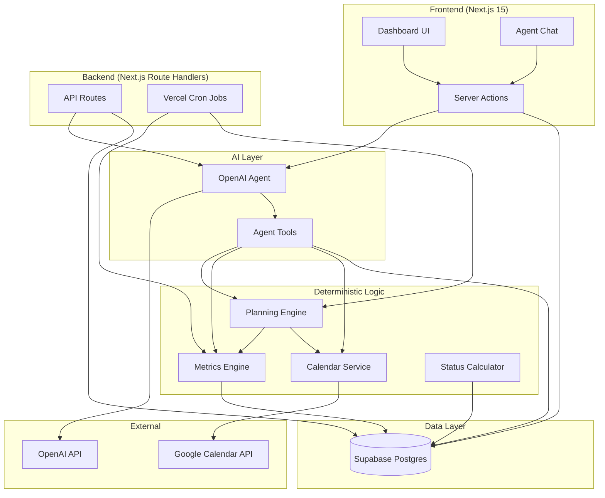

# Primetime Architecture

## Overview

Primetime is a personal execution tracking system that measures the gap between planned commitments and actual execution. It is **not** a todo app or calendar app — it is a personal operating system for accountability.

**Primary insight:** What I said I was going to do vs what I actually did.

## System Architecture



## Source of Truth

```
Database (Supabase) = Source of Truth
LLM = Reasoning Layer (reads state, proposes actions)
Google Calendar = Read-only availability input
```

The LLM **never** owns state. All goals, tasks, statuses, progress, summaries, and insights live in Postgres. The agent reads via tools and writes via tools that execute deterministic backend code.

## Data Flow

### Daily Planning (6:00 AM Cron)

```
1. Cron triggers /api/cron/daily-plan
2. generateTasksFromGoals() — creates tasks from active weekly goals
3. getCalendarEvents() — reads Google Calendar for busy blocks
4. findAvailableSlots() — deterministic slot calculation
5. generateDailyPlan() — matches tasks to slots by priority + pace
6. applyDailyPlan() — schedules tasks, records task_events
```

### Daily Summary (9:00 PM Cron)

```
1. Cron triggers /api/cron/daily-summary
2. generateDailySummary() — deterministic metrics from task data
3. enrichSummaryWithAI() — AI generates reflection (went_well, went_poorly, changes)
4. Stored in daily_summaries table
```

### Weekly Summary (Sunday 8:00 PM Cron)

```
1. Cron triggers /api/cron/weekly-summary
2. generateWeeklySummary() — goal completion, priority analysis, best/worst days
3. generateInsightsFromHistory() — pattern detection from task history
4. Stored in weekly_summaries + behavior_insights tables
```

### Agent Chat

```
1. User sends message via chat UI
2. Message stored in agent_messages
3. Agent receives conversation history + system prompt
4. Agent calls tools to read/write database state
5. Response stored in agent_messages
6. UI displays response
```

## Layer Separation

| Layer | Responsibility | Technology |
|-------|---------------|------------|
| UI | Display state, user input | Next.js pages, React, Tailwind |
| Server Actions | Client → server mutations | Next.js Server Actions |
| API Routes | Cron, external access | Next.js Route Handlers |
| Services | Business logic, DB access | TypeScript modules |
| Metrics | Calculations (deterministic) | Pure functions |
| Agent | Reasoning, coaching, reflection | OpenAI Agents SDK |
| Agent Tools | Bridge agent ↔ services | OpenAI tool definitions |
| Database | Persistent state | Supabase Postgres |

## Database Schema

```
weekly_goals ──┐
               ├── action_tasks ── task_events
               │
daily_summaries
weekly_summaries
behavior_insights
agent_conversations ── agent_messages
```

### Key Relationships

- `action_tasks.weekly_goal_id` → `weekly_goals.id` (nullable for one-time tasks)
- `task_events.action_task_id` → `action_tasks.id` (audit trail, never deleted)
- `agent_messages.conversation_id` → `agent_conversations.id`

## Agent Tool Catalog

| Tool | Type | Purpose |
|------|------|---------|
| `get_active_goals` | Read | Current week goals |
| `get_tasks_for_day` | Read | Tasks for a date |
| `get_goal_progress` | Read | Pace, completion %, daily targets |
| `get_calendar_availability` | Read | Events + free slots |
| `create_task` | Write | New action task |
| `update_task_status` | Write | Status change + audit event |
| `log_task_progress` | Write | Partial/full completion |
| `generate_daily_plan` | Compute | Schedule recommendations |
| `generate_daily_summary` | Compute | End-of-day summary |
| `generate_weekly_summary` | Compute | End-of-week summary |
| `get_behavior_insights` | Read | Long-term patterns |

## Metrics (All Deterministic)

| Metric | Formula |
|--------|---------|
| Execution Rate | completed / planned |
| Planning Accuracy | 1 - abs(1 - actual/estimated) |
| Goal Completion % | min(1, current/target) |
| Pace Status | current vs expected linear pace |
| Priority Reliability | per-priority completion rate |
| Execution Score | execution_rate × 0.6 + commitment_score × 0.4 |
| Weekly Commitment Score | avg goal completion % |

## Security Model (MVP)

- Single-user, no authentication
- Cron endpoints protected by `CRON_SECRET` bearer token
- Supabase service role key server-side only
- Google Calendar read-only via OAuth refresh token
- OpenAI API key server-side only

## Deployment

```
Vercel
├── Next.js app (SSR + API routes)
├── Cron jobs (vercel.json)
├── Environment variables
└── Supabase (external, managed Postgres)
```

## File Structure

```
src/
├── app/                    # Next.js App Router pages + API
│   ├── today/              # Today dashboard
│   ├── goals/              # Weekly goals view
│   ├── calendar/           # Calendar + availability
│   ├── chat/               # Agent chat
│   ├── insights/           # Behavioral insights
│   └── api/
│       ├── chat/           # Chat endpoint
│       ├── calendar/       # Calendar events
│       └── cron/           # Scheduled jobs
├── actions/                # Server Actions
├── agent/                  # OpenAI Agent + tools
├── components/             # React UI components
├── lib/                    # Utilities, Supabase client, dates
├── services/               # Business logic layer
└── types/                  # TypeScript types
supabase/
└── migrations/             # SQL schema
docs/                       # Architecture, wireframes, roadmap
```
